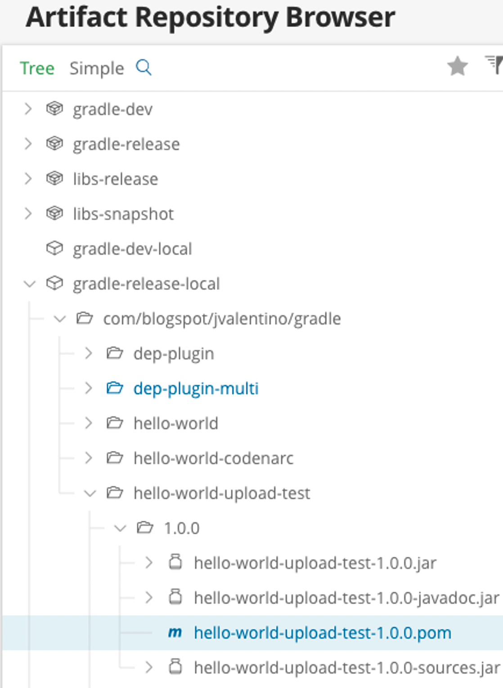

## 5.3 Common Maven Upload

Another common need when doing library development, is the ability to upload that library to a central location so other applications can use it. In the example plugin libraries so far, they have included additions that make the take both the source code and the docs ant put them in independent jars. This includes the use of the Maven plugin to upload those jars into a Maven repository, by username and password.

#### build.gradle

```groovy
task sourcesJar(type: Jar, dependsOn: classes) {
    classifier = 'sources'
    from sourceSets.main.allSource
}

task javadocJar(type: Jar, dependsOn: groovydoc) {
    classifier = 'javadoc'
    from groovydoc.destinationDir
}

artifacts {
    archives sourcesJar
    archives javadocJar
}

uploadArchives {
    repositories {
        mavenDeployer {
            repository(url:
                "http://localhost:8081/artifactory/gradle-release") {
                authentication(
                    userName: "admin", password: "changeit")
            }
        }
    }
}

```

Lines 66-91 contain the Gradle code responsible for doing a maven based deployment of project artifacts.

 

#### src/main/groovy/com/blogspot/jvalenitno/gradle/CustomMavenPlugin.groovy

```groovy
class CustomMavenPlugin implements Plugin<Project> {

    void apply(Project project) {
        Map props = project.properties

        project.configure(project) {
            apply plugin:'maven'

            afterEvaluate {
                project.task('sourcesJar', type:Jar, 
                    dependsOn:classes) {
                    classifier = 'sources'
                    from sourceSets.main.allSource
                }

                project.task('javadocJar', type:Jar, 
                    dependsOn:groovydoc) {
                    classifier = 'javadoc'
                    from groovydoc.destinationDir
                }

                artifacts {
                    archives sourcesJar
                    archives javadocJar
                }

                uploadArchives {
                    repositories {
                        mavenDeployer {
                            repository(url:props.url) {
                                authentication(
                                        userName:props.username,
                                        password:props.password)
                            }
                        }
                    }
                }
            }
        }
    }
}

```

**Line 15: Project properties**

The assumption is that the URL, username, and password are to be provided by Gradle properties. This allows those vales to come from project property file, parameters, or environment variables. Note that these values will not be populated under **afterEvaluate**.

 

**Line 17: Project.configure**

The closure of project.confgure represents the root of the applying build.gradle.

 

**Line 18: Parent plugin**

This plugin is dependent on the Maven plugin, to it is applied to the build.

 

**Line 20: afterEvaluate**

Since the deployment settings rely on project properties, these cannot be applied until after build evaluation has occurred. Otherwise, the expected values will be null.

 

**Lines 21-49: The code**

The code required for Library, source, and document uploaded is added, mostly unmodified. Note that task definition requires the use of **projet.task**, instead of being able to use task directly.

#### plugin-tests/local/build.gradle

```groovy
buildscript {
  repositories {
	jcenter()
  }
  dependencies {
    classpath 'com.blogspot.jvalentino.gradle:custom-maven:1.0.0'
  }
}

apply plugin: 'custom-maven'
apply plugin: 'groovy'

// GROOVY
version = '1.0.0'
group = 'com.blogspot.jvalentino.gradle'
archivesBaseName = 'hello-world-upload-test'

repositories {
    jcenter()
    mavenCentral()
}

dependencies {
    compile gradleApi()
    compile 'org.codehaus.groovy:groovy-all:2.4.12'

    testCompile 'org.spockframework:spock-core:1.1-groovy-2.4'
}

```

The testing of the plugin requires a project that is a library, so the “Hello World” example Gradle plugin library is used.

 

#### plugin-tests/local/gradle.properties

```properties
username=admin
password=changeit
url=http://localhost:8081/artifactory/gradle-release

```

The plugin properties are specified via the gradle.properties file. For demonstration purposes the local installation of Artifactory is used.

 

#### Manual Testing

```bash
plugin-tests/local$ gradlew build upload

BUILD SUCCESSFUL

```

Manually testing the plugin required first building the artifatcts, and then calling the upload task.



The end-result is that the three different Jar artifacts and available in the reposisotyr, including the POM.

#### src/test/groovy/com/blogspot/jvalenitno/gradle/CustomMavenPluginTestSpec.groovy

```groovy
class CustomMavenPluginTestSpec extends Specification {

    Project project
    CustomMavenPlugin plugin

    def setup() {
        project = Mock(ProjectInternal)
        plugin = new CustomMavenPlugin()
    }

    void "test plugin"() {
        when:
        plugin.apply(project)

        then:
        true
    }
}

```

Just as with the other plugins that are just customized configurations of existing plugins, there is very little (if any ) code to be tested. This functionalilty is an integration, and would therefore require intergration testing or higher to validate appropriatley.


